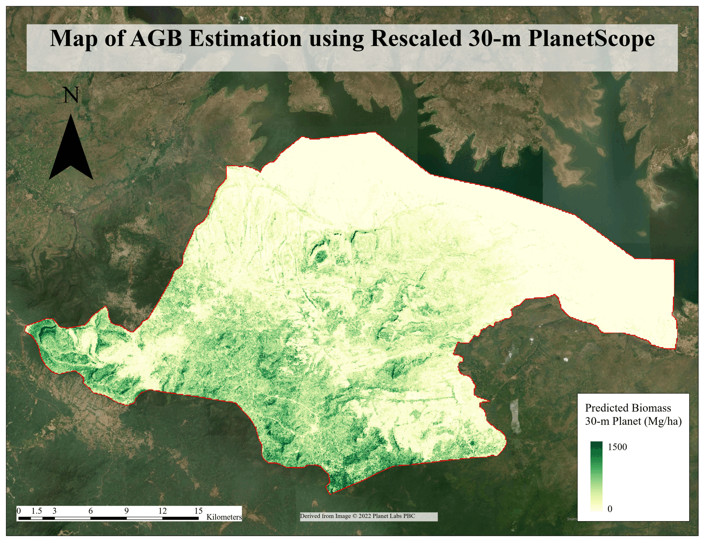
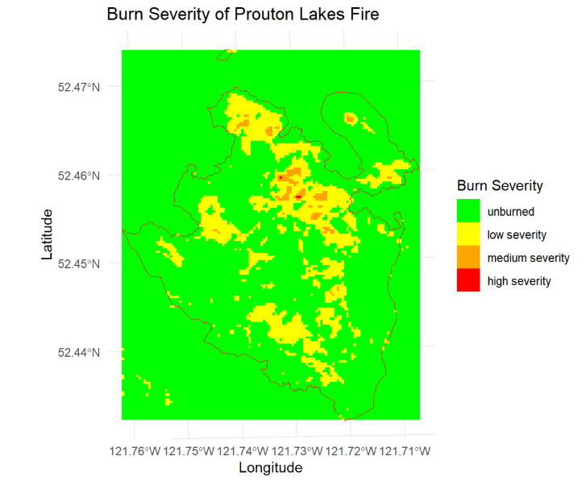
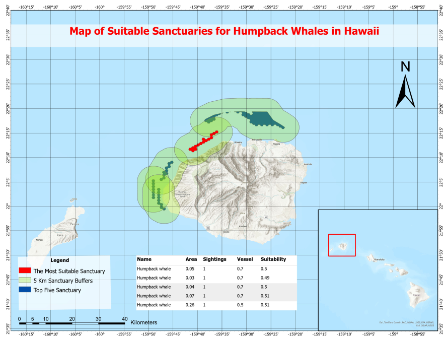
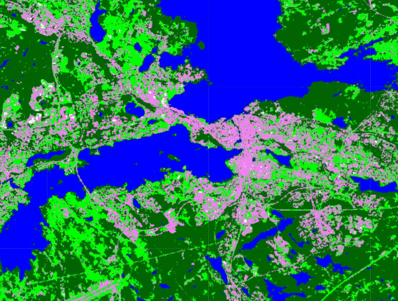

::: {style="text-align: center; margin-top: 30px;"}
```{=html}

```
:::

#### My name is Hieu (pronounce as "Heal") Phung. You can call me Harry.

### Welcome to my e-portfolio 👋

I am a fresh graduate student in Master of Geomatics for Environmental Management at The University of British Columbia.

Before coming to Canada, I have completed my Bachelor's and a Master's programme in Environmental Engineering in Finland. After my first master's graduation, I decided to revolve my career path to the field of GIS and Forestry because I recognized an interconnection between environment, forestry and remote sensing field. What I am aiming to do is to use the hands-on experience in GIS, spatial statistics, and spatial analysis in applications such as urban forestry monitoring, water resource and water infrastructure management, climate adaptation, etc. 

In my e-portfolio, I hope to deliver insights, creativity and innovations to readers.

Thank you and enjoy your time exploring my space. Should you have any questions, please do not hesitate to send me an email.

-   Skills: ArcGIS Pro, QGIS, R coding, Python, ENVI, eCognition, Google Earth Engine, AutoCAD, AutoCAD Plant 3D

<p style="text-align: center; margin-top: 30px;">

<a href="contact.html" style="background-color: #4CAF50; color: white; padding: 12px 24px; text-decoration: none; font-size: 16px; border-radius: 8px;"> Contact Me </a>

</p>

## Featured Projects

:::::: {.container-fluid .px-0}
::::: {.row .align-items-center style="background-color: #e8fdf3; border-radius: 12px; padding: 30px; margin-bottom: 30px; box-shadow: 0 4px 12px rgba(0,0,0,0.05);"}
<!-- Left column: Text -->

::: {.col-lg-6 .col-md-6}
<h3><strong>Detecting Change of AGB in Ghana</strong></h3>

<p>This project compares satellite-based approaches—Landsat 9, PlanetScope, and resampled PlanetScope—using GEDI L4A as reference data to identify the most accurate method for estimating AGB in Kwahu South, Ghana.</p>

<a href="https://hieu-phung242.github.io/hieuphung/final_project.html#code-snippets" class="btn btn-dark">Learn More</a>
:::

<!-- Right column: Image -->

::: {.col-lg-6 .col-md-6 .text-center}
```{=html}

```
:::
:::::
::::::

:::::: {.container-fluid .px-0}
::::: {.row .align-items-center style="background-color: #e8fdf3; border-radius: 12px; padding: 30px; margin-bottom: 30px; box-shadow: 0 4px 12px rgba(0,0,0,0.05);"}
<!-- Left column: Text -->

::: {.col-lg-6 .col-md-6}
<h3><strong>Burn Severity and Vegetation Recovery Analysis</strong></h3>

<p>This project assesses burn severity at Prouton Lake in British Columbia by classifying fire-affected areas based on ecological change. It also analyzes vegetation recovery from 2018 to 2021 to understand post-fire ecosystem dynamics.</p>

<a href="https://hieu-phung242.github.io/hieuphung/gem520_finallab.html" class="btn btn-dark">Learn More</a>
:::

<!-- Right column: Image -->

::: {.col-lg-6 .col-md-6 .text-center}
```{=html}

```
:::
:::::
::::::

:::::: {.container-fluid .px-0}
::::: {.row .align-items-center style="background-color: #e8fdf3; border-radius: 12px; padding: 30px; margin-bottom: 30px; box-shadow: 0 4px 12px rgba(0,0,0,0.05);"}
<!-- Left column: Text -->

::: {.col-lg-6 .col-md-6}
<h3><strong>Analysis of Suitable Sanctuaries for Humpback Whale</strong></h3>

<p>This project identifies the five most suitable areas for humpback whale sanctuaries in Hawaii using suitability and overlay analysis based on weighted environmental and human activity criteria. The goal is to support conservation efforts by expanding protected habitats within the Hawaiian Islands Humpback Whale National Marine Sanctuary.</p>

<a href="https://hieu-phung242.github.io/hieuphung/gem510_lab3.html" class="btn btn-dark">Learn More</a>
:::

<!-- Right column: Image -->

::: {.col-lg-6 .col-md-6 .text-center}
```{=html}

```
:::
:::::
::::::

:::::: {.container-fluid .px-0}
::::: {.row .align-items-center style="background-color: #e8fdf3; border-radius: 12px; padding: 30px; margin-bottom: 30px; box-shadow: 0 4px 12px rgba(0,0,0,0.05);"}
<!-- Left column: Text -->

::: {.col-lg-6 .col-md-6}
<h3><strong>Image Classification using Google Earth Engine</strong></h3>

<p>This project used Google Earth Engine (GEE) to perform supervised land cover classification in Finland using Random Forest, CART, and Naive Bayes algorithms. It aimed to compare the performance of these models while exploring GEE’s capabilities for scalable remote sensing analysis.</p>

<a href="https://hieu-phung242.github.io/hieuphung/gem521_lab9.html" class="btn btn-dark">Learn More</a>
:::

<!-- Right column: Image -->

::: {.col-lg-6 .col-md-6 .text-center}
```{=html}

```
:::
:::::
::::::
